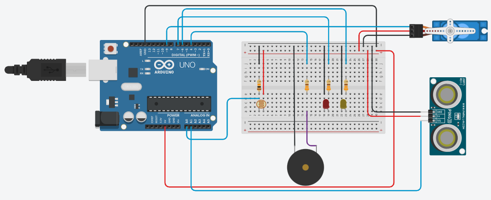

# Task 2 

The second task was about opening a garage with a servomotor and turning on the lights when a car is going to go through. When a sensor detects that the car is already into the garage the program has to turn off the lights and close de garage with an alarm.

You can simulate the circuit in [Tinkercad](https://www.tinkercad.com/things/0wwYagGQ37i-garage)