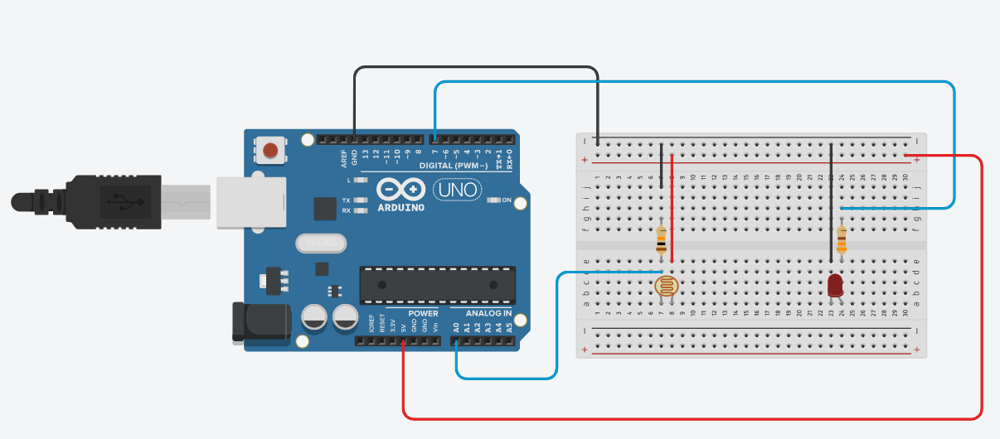

# Practice 5

This practice is about lighting a led when is dark. You can see the circuit below.

You can simulate the circuit in [Tinkercad](https://www.tinkercad.com/things/5sakcg6F8Qk-photosensort)