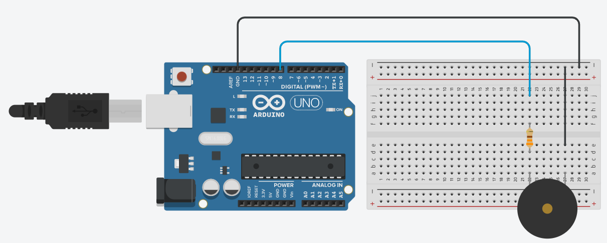

# Practice 6

This practices is about buzzer playing in different musical tones. You can see the circuit below.

You can simulate the circuit in [Tinkercad](https://www.tinkercad.com/things/48CUdISmjDI-buzzer)