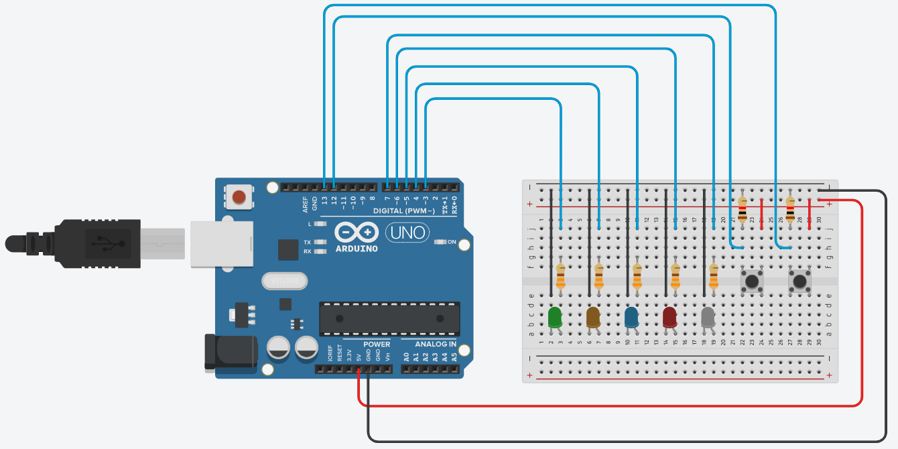

# Task 1

Four leds are lightning at certain pace, the switches change the peace at the leds turn on.

You can simulate the circuit in [Tinkercad](https://www.tinkercad.com/things/fGUNq9KjPYq-fiveleds)